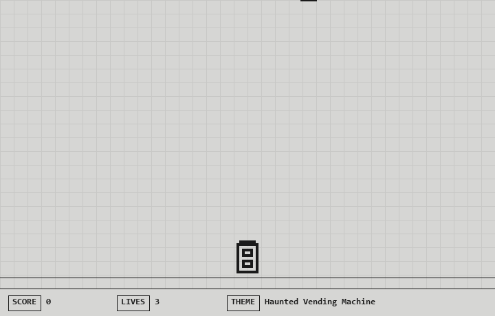

# I told an AI studio-mate to build me a game in one tool call

I gave a fake game jam an AI studio-mate, put 18 studio tools behind a single Toolbox
endpoint on Foundry, wrapped the whole flow in **Routines** (kickoff → prototype →
playtest → ship), and let the **GitHub Copilot SDK**'s code-emitting muscle write a
**real playable HTML5 game** to disk. Same principle as the other demos —
**big box, tiny context** — but this one you can actually _play_ at the end.

## What it does

`pixel-jam-studio` runs a 48-hour jam in about 30 seconds of terminal output:

- 🎡 **kickoff** — spin the theme wheel (lands on _Haunted Vending Machine_)
- 🎨 **prototype** — pick sprites, grab a chiptune loop, add 8-bit SFX, then
  emit a complete `index.html`
- 🎮 **playtest_loop** — headless playtest twice, watch the fun-score climb
- 🚀 **ship_it** — get judged, ship to the arcade cabinet

Nine plain-English turns, nine different studio stations. It runs locally with
`make demo` — no Azure, no model key. When it finishes, it prints a `file://` link
to a real playable HTML5 canvas game.



## The trick

Same as the others: `{"type": "toolbox_search_preview"}` is on, so the model only ever
sees `tool_search` (say what you need) and `call_tool` (run it). Eighteen studio tools
behind the box, two in front of the model.

What's new here is the **code-emission moment**: one of those tools, `code_scribe.write_game`,
is the "coding-agent" step. In this demo it stamps a real playable game from a template;
in `--live` mode the Copilot SDK writes the source itself.

```
>_ user: "okay, write the actual game code now"
   [tool_search] query: "write a complete playable html5 canvas game to disk from the spec"   // round-trip #5
   [matched]     code_scribe.write_game, asset_studio.generate, playtest_arcade.run, ...
   [call_tool]   code_scribe.write_game({ theme:"Haunted Vending Machine", sprites:..., bgm:... })
   => wrote game-output/index.html (~200 lines) — open it in a browser to play
tools in box: 18   ·   tools in model context: 2
```

## What I used to build the game — and why

| Piece | What it does | Why it's here |
| --- | --- | --- |
| **Toolbox with Tool Search on Foundry** | One MCP endpoint hides 18 tools; only `tool_search` + `call_tool` reach the model | Big box, tiny context. Add a 19th studio tool without touching agent code. |
| **Routines** | Named phases (`kickoff`, `prototype`, `playtest_loop`, `ship_it`) that group the calls | Shapes the "ceremony" of the jam; makes the flow legible on screen and easy to re-run. |
| **GitHub Copilot SDK** | Same agent runtime that powers Copilot CLI, embeddable in any app via JSON-RPC | It's the code-emitter. Games are files; the SDK's whole point is that an agent can write files. `code_scribe.write_game` is where a real Copilot-SDK agent takes over in `--live`. |

The reason those three pillars are here together, and not any one alone:

- **Toolbox alone** would give you tool discovery but no ceremony and nothing to _make_.
- **Routines alone** would give you a script with no governed tool surface.
- **Copilot SDK alone** would happily write files but wouldn't know which studio tools
  to reach for.

Together they're the shape of a real agent app: **governed tool discovery + a
routine that shapes intent + an agent that emits real artifacts**.

## The numbers

- Tools in the box: **18**
- Tools in the model context: **2** (`tool_search` + `call_tool`)
- `tool_search` round-trips: **9**
- Routines: **4** (`kickoff`, `prototype`, `playtest_loop`, `ship_it`)
- Guarded tools that require approval: **1** (`leaderboard_cabinet.post`)
- Playable HTML files produced by the run: **1** — a real one, ~200 lines, 6 KB
- Lines of agent code that changed when I added a 19th studio tool: **0**

## Run it locally

Prereqs: **Python 3.10+**. Nothing else. No Azure, no model key, no dependencies to install.

```bash
git clone https://github.com/LadyNaggaga/creativetoolbox
cd creativetoolbox/demos/pixel-jam-studio

make demo        # runs the jam, writes game-output/index.html
make play        # opens the game in your default browser
```

That's it. `make demo` starts the local Toolbox emulator, walks through the nine turns,
and drops a real playable `index.html` in `game-output/`. `make play` opens it.

**Controls:** ← → or A/D to move · P to pause · R to restart · click **▶ START** to begin
(the intro types itself out first).

Want to remix it?

- Change the theme wheel in `mock-backends/hero_tools/theme_wheel_spin.py`
- Add a new studio tool in `mock-backends/tools.json` — the agent code doesn't change
- Tweak the game template in `mock-backends/hero_tools/code_scribe_write_game.py` —
  that's the template a real Copilot-SDK agent would replace with model-generated code

## Go real

```bash
pip install -e "python/.[live]"        # installs github-copilot-sdk
python python/main.py --live
```

In `--live` mode the Copilot SDK drives the whole loop from your app: it calls
`tool_search`/`call_tool` itself and, at the code-emission step, writes the game
source directly rather than stamping a template.

## Honest caveats

Tool Search is in preview. The scripted mode uses a local emulator that ranks by
keyword overlap — it's a faithful stand-in for the shape of the real endpoint, but the
production ranker is smarter. The game is deliberately tiny (one screen, three sprite
kinds, two SFX) — the point is that an agent can emit a playable, opinionated artifact
from a spec, not that this specific game is a masterpiece.

>_ happy jamming.
